# Bloggerverse

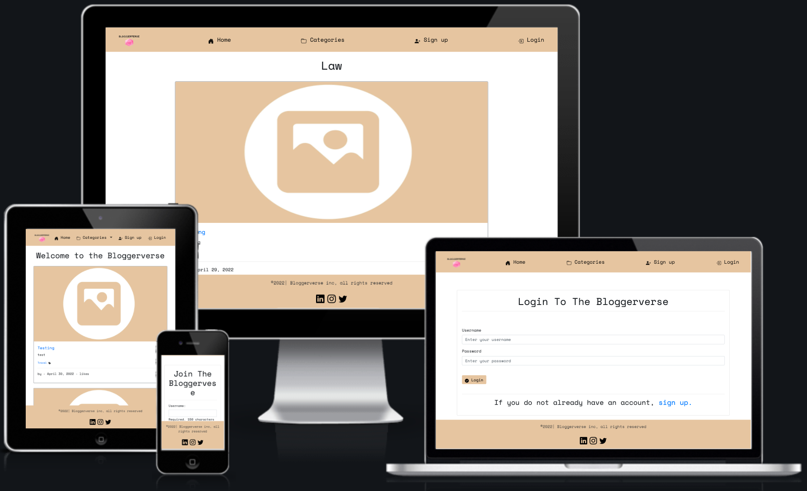

:globe_with_meridians: [Live Website](https://bloggerverse.herokuapp.com/),

 [Github repository](https://github.com/bmcdonald2000/Eyes.In.The.Sky)

## What is Bloggerverse ? :bulb:
Bloggerverse is a blogsite for people intrested in cultivating a blogging community, in which users can learn from, discuss with and connect with like minded individuals. 

<strong>Table of contents:</strong>

 

[User Experience (UX)](##User-Experience-(UX))

[Features](##Features)

[Technologies used](##Technologies-used)

[Testing](##Testing)

[Deployment](##Deployment)

[Known bugs](##Known-bugs)

[Credits](##Credits)

## User Experience (UX) 

### User Stories :scroll:

When designing my user stories I used the moSCow prioritisation technique and designed the user story table to help keep the project on track. The meaning of each label can be found in the key below. :point_down:

**Key:**

|Label| Definition|
|-----------------|-----------|
| |Requirement is necessary for the project to be conisdered as successfully completeted.|
| |Requirement is important but not neccessary for the project to be conisdered as successfully completeted.
| |Requirement is a bonus to the project and if not included the impacts are less significant that a 'must have' or 'should have'.|
|| Requirement are not considered as a priority for the project, given the timeframe but may be revistited when implementing future features.|

**Table:**

|User Type|   User Story |  Priority	|
|-----------------|-----------|-----------|
||  I want to be able to view blog posts, without logging in or signing up | | 
| |  I want to be able to view blog posts snippets from the home page | | 
| |  I want to be able to view detailed blog posts easily| | 
| |  I want to be able to add my own blog posts| |
|| I want to be able to edit my own blog posts||
| |  I want to be able to delete my own blog posts| |
|| I want to be to add comments to blog posts||
| |  I want to be able to like/dislike blog posts| |
| |  I want to be able to see the number of likes a posts has| |
||  I want to be able to sign up | |
||  I want to be able to login/logout | |
| |  I want to be notified when an action is successful/unsuccessful| | 
||  I want to be able to create my own profile | | 
| |  I want to be able to view/edit my profile| | 
| |  I want to be able to view the post authors profile| | 
| |  I want to be able to reset my password| |
||I want to be able to report offenesive content||
||I want to be able to easily manage posts, users and comments||
||I want to have my own admin area||
||I want to be able to add my own posts and comments||
||I want to be able to use other social media to login||

### Design :art:

The main goal was to make an intuitive UX, so that the user is not confused when visiting the Website. To achieve this, I created a simple, succinct, web application. The navabar is present on every page with clear icons for easy navigation.

The user experience should be tailored. To ensure this navbar items vary based on whether the user is authenticated, so that users who are not logged in aren't shown features that are not available to them.

If a user tries to access a page they are not auhtorised to, they are informed why they can't see the page and a link is provided so that they can rectify the issue in one click. 

All user actions shoud return a response. To ensure this is possible there are specific success and error messages displayed as result of a user action. Page redirects are also used to make it obvious that an action has been successfully completed.

**• Colour scheme**

   ° I have gone for a simple beige (#e5c6a0) , as this is a neutral but trendy colour. To enusre accessibility for all users I used a monchrome design for the text. All  text and Icons are displayed in black text (#ffffff) on a white card (#000000).To find the shade of beige that offers the best contrast with these font colours I used [WebAim](https://webaim.org/resources/contrastchecker/). 

**• Typography**

   ° In keeping with the minimalistic style of the website, I have chosen to use an original fixed-width type family font 'Space Mono' as it was developed for editorial use in headline and display typography. Tying in with the purpose of the web application. 
   
   ° I want the users to be carefree whislt using the site as the purpose of the site is to alow the users to share/explore different ideas and connect with like minded individuals. The style of 'Space Mono' makes it easy to read and fosters the care free vibe, I want the users to experience. 

**• Imagery**

   ° The default blog images was created using [Canva](https://www.canva.com)

   ° The icons used throughout the site are [Boostrap](https://unpkg.com/boxicons@2.0.9/css/boxicons.min.css') icons

   ° The logo was created using [Tailor Brands](https://www.tailorbrands.com/logo-maker) 

**• Wireframes**

   ° Wireframes were created using figma. To meet my UX objective of creating a simple and intuitive User Interface (UI), I took a minimalisitic approach with the wireframes, to provide flexibility so that the project can evolve in accordance with user feedback. Without straying from the mnimilistic theme. Here is the link to [my wireframes](https://www.figma.com/file/f2grvaqVv3paHrMBZUmhah/Ms4) for desktop and mobile. After listening to user feedback during the project; further features were added, so not all features are represented in the wireframes. However, all [features](##Features) will be discussed later in the README. Below are screenshots of the desktop and mobile Wireframes. :point_down: 

   **Home screen** - screenshot for Desktop :desktop_computer: and Mobile :iphone:

   When viewing posts by category the same layout will be used, so a seperate wireframe was not created for that page. 

   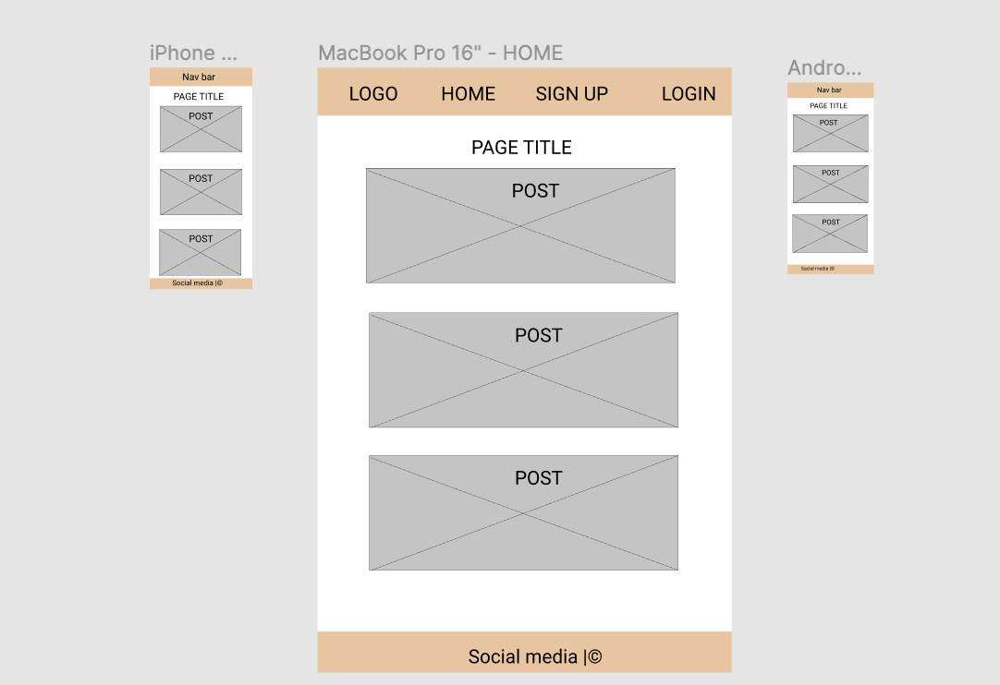

   **Forms**  - screenshot for Desktop :desktop_computer: and Mobile :iphone:

   All the forms used in this web application have a uniform style and appear on a seperate page.

   
   
## Features 

As previously explained (:point_up: ) new features were added during the project in response to user feedback. I will be explaining the current features, breaking them down into main and bonus features to help demostrate the progression of the project. Some future features will also be discussed.

**Site User**

First I will be looking at the features for site users

### **Current Features:** :white_check_mark:

#### **Main Features:** :jigsaw:

The following features are features that were essential to the project and are highlighted as must have or are an important should have.

#### **Nav Bar**

• The Navbar is available on every page, this allows seamless navigation across the web application, ensuring the main features are acessible in one click. The standard Navbar is show below. :point_down:

• The navbar is also personalised so that the user experience is tailored. 

  ° When logged in the user will see a Navbar that looks similar to the screenshot below. :point_down:

  

  ° The standard Nav bar is shown when a user is not logged in, this is so that the user is only shown areas they have access to.
    
#### **Landing page**

• The landing page is simple keeping with the minimalistic theme of the site. All blog post are displayed with post snipits on a white card to give it a more modern feel. 

° The landing page is also personalised for logged in users adding to the personalised feel of the site. This is demonstrated below :point_down:

° Each blog post includes hyperlinks to view the full post or other posts under the post category. It is also possible to see the author, date of post and number of likes. Screenshot are shown below :point_down:

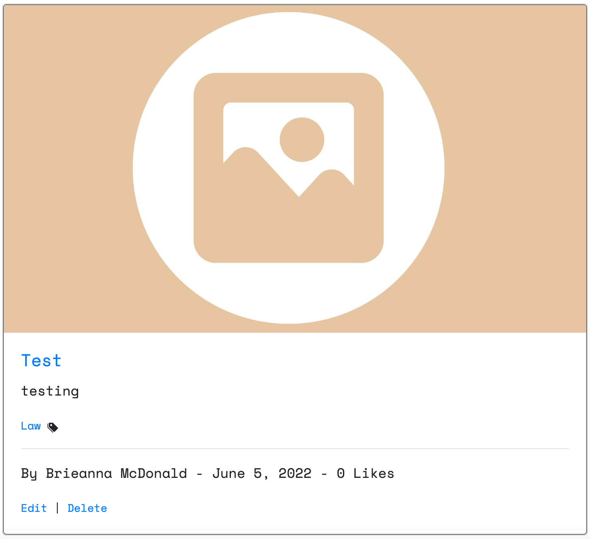

#### **Forms**

All the forms used have a uniformed simple style keeping with the minimalistic theme.

**Signup**

• The Signup form can be seen below, this form is easily accessible from the Navbar and links are available on the login page also. :point_down:

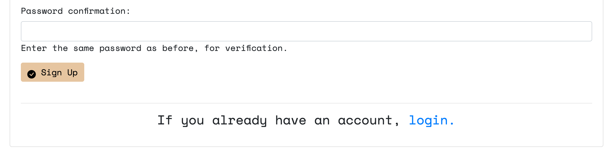

**Add Post**

• The form used to add posts can be seen below, this is easily accessible from the Navbar and links are available on the login page also. :point_down:

° The form uses a richtext field to give the user more freedom in styling their post. 

°A dropdown is also used to allow the user to select an existing category for the post.

° If the user has not completed profile setup they will not be able to make a post. This prevents an error being returned when there is no id for user making the post. (Shown below) :point_down:

° If the user is not logged in and tries to add a post, they will be prompted to login or sign up. With links to the relvant form being displayed. (Shown below) :point_down:

**Edit Post**

• The form used to Edit posts can be seen below, this is easily accessible from the posts. :point_down:

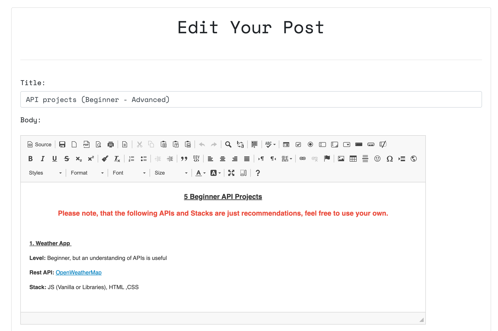

**Delete Post**

• The form used to delete posts can be seen below, this is easily accessible from the post. :point_down:

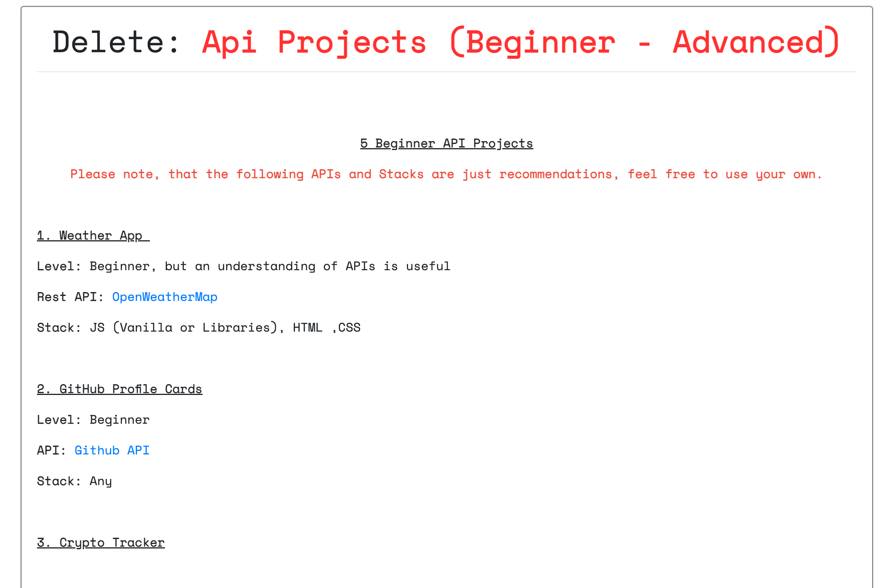

° Once a post is deleted the user will be informed as seen below :point_down:

### Login/Logout

• Django authentication is used for user login/logout. The user is able to tell when they are logged in by the changes in the nav bar (these have been shown previously :point_up: ). 

° When logging in the user is prompted if the login is unsuccessful. The login form is shown below, along with the error message.

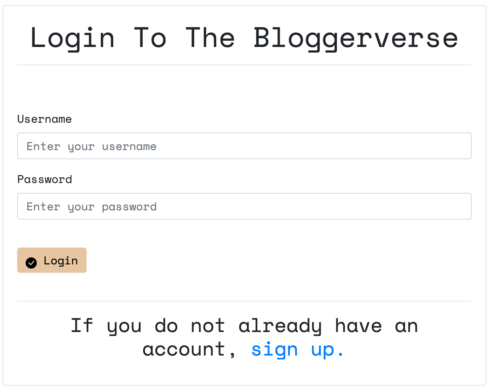

#### Add Post image

• Users are able to add their own images which will be used when displaying post snippets on the landing page. :point_down:

° The uploaded image is stored using cloudinary and will be displayed as seen in the screenshot below

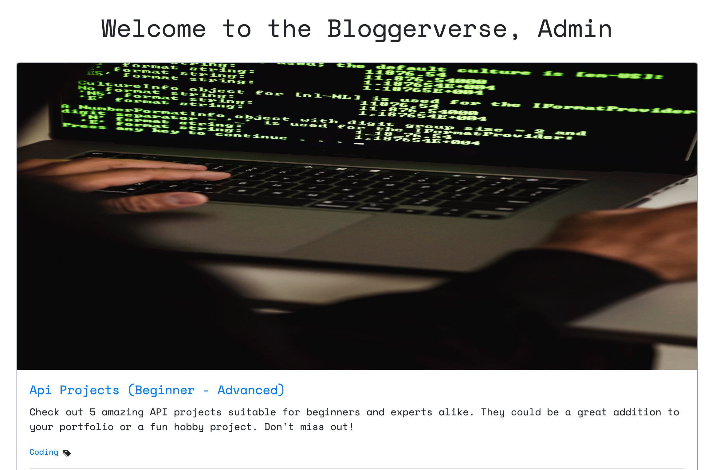

° If a user does not upload an image a default image will be used as seen below. :point_down:

#### Add Comments

• All Authenticated users are able to leave comments, using the comment form shown above :point_up: in the [forms](####Forms) section. The comments are then displayed in the comment section.For the users convenience they are redirected to the posts they left a comment under.  as seen below. :point_down:

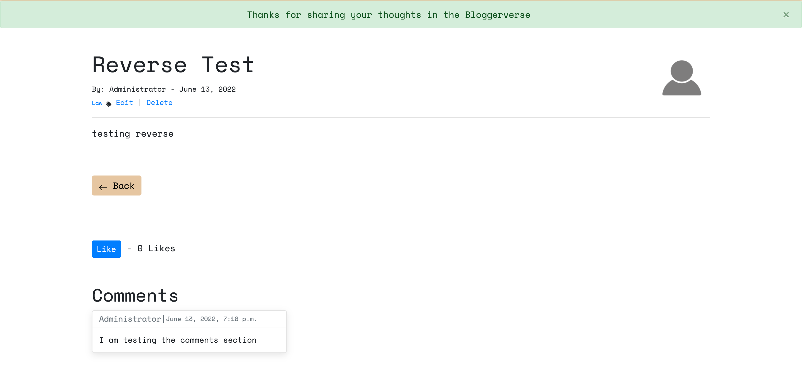

#### Like button

• All users are able to see the number of likes a post has, but must be logged in to like a post :point_down:

° When logged in the user can like or dislike a post, the button changes dynamically to prevent multiple likes/dislikes from the same person.

#### Footer

• The footer contains buttons with links to Github, LinkedIn and Email where the can contact me. Twitter and Instagram links are also included although the bloggerverse does not have a page on these platforms. All of the links open in a new tab for the users convenience. :point_down:

**Bonus features** :sparkle:

These features are features that were either considered a could have or requested by users during testing.

#### Add Categories

• Authenticated users are able to create their own categories, to ensure that users have as much influence over the site as possibly.
 For ease this is a Navbar item when users are authenticated, making the form accessible from every page.  :point_down:

 ° Once a user has created a category they are notified and redirected to the categories page, to make it clear that it was successful.

 ° If a user tries to add a category that already exists they will be told that the category already exists. 

#### Search by Category

• All post are assigned a category so that the users can view post by category.page.  :point_down:

° A user can either use the category hyperlink on a post :point_up: to see other posts in that category. An example of the category page is shown below :point_down:

° If a user tries to access a catogory that does not exist or has no post yet they will see the following page :point_down:

° Or a user can use the catgory list page to search for posts in a specific category :point_down:

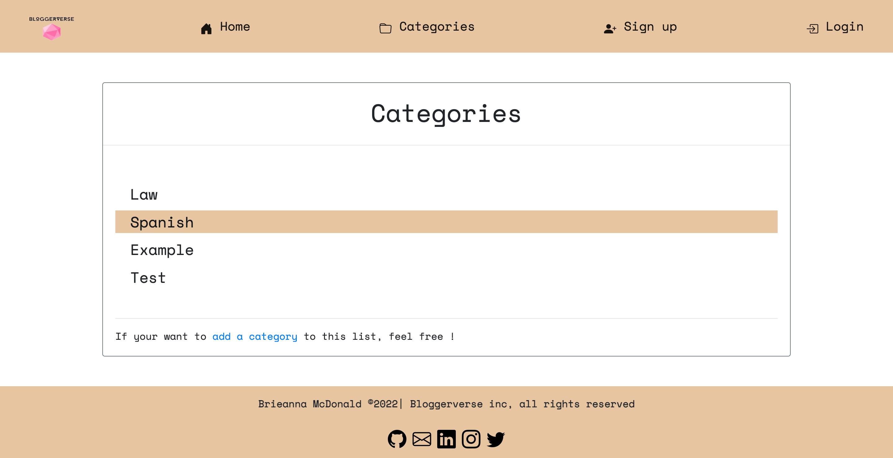

° Categories also display as a dropdown in the navbar

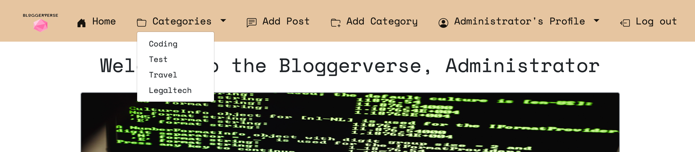

#### Create Profile

• Authenticated users are able to create their profile, the user is redirected to this page after signup and the link to this page is acesssible from the navbar. The form used for the create profile page is shown below  :point_down:

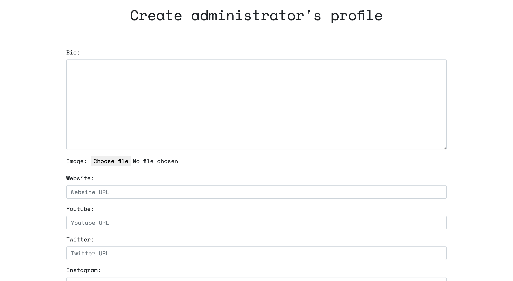

° The information added by the user is then available for other users via the view author profile card at the bottom of each post. :point_down:

#### Edit Profile

• Authenticated users are able to edit their profile, to ensure all information is up to date. The form used for the edit profile page is  shown below :point_down:

#### Change Profile settings

• Authenticated users are able to change their profile settings, to ensure accounts are kept secure. The form is shown below. :point_down:

° The link in the image :point_up: above directs you to the change password form (shown below). :point_down: 

#### Change Password

• Authenticated users are able to change their passowrd, to ensure accounts are kept secure. The form used for change password page is  shown below.:point_down:

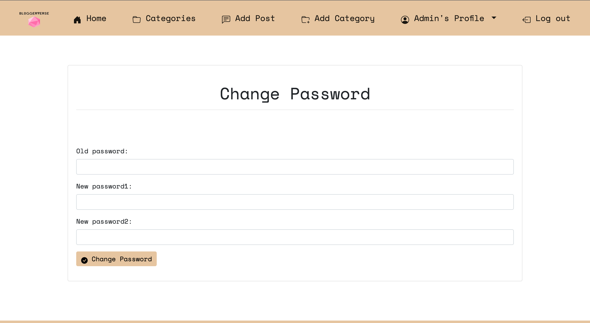

#### View Authors Profile

• Users are able to view the post authors profile page, in order to connect and learn more about like minded individuals. This section is shown in the following screenshot. :point_down:

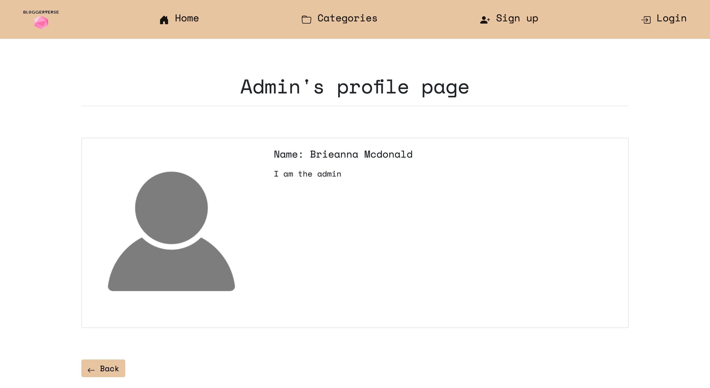

### Future features :rocket:

#### Social Media Login

• In the future users will be able to login using exsting social media accounts such as google to make logging in easier.

**Site Admin**

### **Current Features:**

The Admin panel currently allows control over the following:

##### Users

• Admin can Add users
• Admin can Delete users
• Admin can Edit users settings/profile
• Admin can view users settings/profile

##### Posts

• Admin can Add posts
• Admin can Delete posts
• Admin can Edit posts
• Admin can view post

##### Categories

• Admin can Add new categories
• Admin can Delete categories

### Comments

• Admin can Add Comments
• Admin can delete Comments
• Admin can view Comments
• Admin can edit Comments

Here is a picture of the admin panel :point_down:

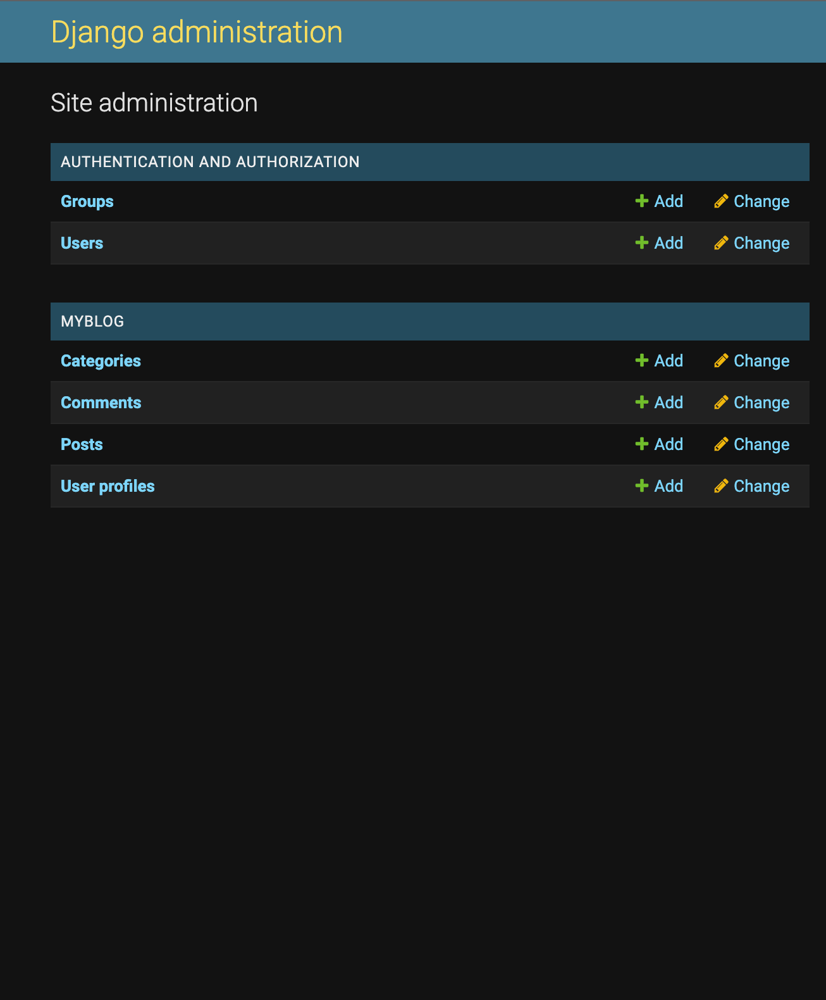

## Technologies used:

#### Languages and librarys used

#### Database used

In Development I used the Django default database SQLite, this is not compatible with Heroku so I switched to Heroku Postgres Prior to Deployment.

#### Cloud Deployment

My web application is deployed on heroku, the [steps taken](##Deployment) are disccused later in the README.

#### Programs used

[Canva](https://www.canva.com/) - I used canva to create my colour palette. I also used Canva to remove the background colour of my logo and the Spiral image on the about us page.

[AmIResponisve](http://ami.responsivedesign.is/#) - I used amiresposive to generate the resposive image at the start of my Readme.

[WebpageTest](https://www.webpagetest.org/)- I used webpage testing to test my webpage across a range of devices.

[Tailor Brands](https://studio.tailorbrands.com/) - I used Tailor brands to create my logo.

[Git](https://git-scm.com/) - I used Git to track the changes to my code. Git was also used for version control.

[Github](https://github.com/) - Github was used to host my project files. I then used Gitpages to deploy the website.

[Vs Code](https://code.visualstudio.com/)- VS Code powers gitpod and was used to build the website.

[Slack](https://slack.com/intl/en-gb/) - I used slack to get feedback on my project.

[Google Fonts](https://fonts.google.com/) - The fonts used are google fonts.

[Figma](https://www.figma.com/) - I used figma to design my mockups.

[Gitpod](https://www.gitpod.io/blog/next-chapter-for-gitpod) - Gitpod is powered by VS Code, storing my code in the cloud. I can then commit that code to my Github repository as Gitpod and Github are connected.

[Lighthouse testing](https://developers.google.com/web/tools/lighthouse) - I used lighthouse testing to test the performance of my webpage.

[Cloudinary](https://cloudinary.com/) - I used cloudinary store media files uploaded by users.

 
	

## Testing :test_tube:

### Code Validation
• W3C HTML Validator - [Passed](https://validator.w3.org/nu/?doc=https%3A%2F%2Fbloggerverse.herokuapp.com%2F)
   
  click the hyperlink above to view my results. :point_up_2:	

• W3C CSS Jigsaw Validator - [Passed](https://jigsaw.w3.org/css-validator/validator?uri=https%3A%2F%2Fbloggerverse.herokuapp.com%2F&profile=css3svg&usermedium=all&warning=1&vextwarning=&lang=en)

  click the hyperlink above to view my results. :point_up_2:	

• JsHint- [Passed](https://jshint.com/)

  click the hyperlink above to view my results. :point_up_2:

  ° I only used a few lines of JS, but had two warnings about renaming. No errors were found.

• Python - Passed

  Initially I had quite a few errors relating to line spacing and line length. These have since been corrected and there are no errors in my workspace. All python code is PEP8 compliant, unless it is not possible to do so(explained below). I have tested the code in all of the files listed below :point_down: using a [PEP8](http://pep8online.com/) validator and I used the [pydocstyle](https://code.visualstudio.com/docs/python/linting#_pydocstyle) linter extension in vscode.

  The settings.py file returned two errors due to Django rules allowing longer line lengths (88 characters) than PEP8 (79 charcaters. 

  This is shown in the screenshot below :point_down:

  

  The Django-Heroku package I have used in my project is also causes an error as it must be importaed at the end of the file, this goes against PEP8 rules but have passed validation using a DJango lynter. 

  This is shown in the screenshots below :point_down:
  

  

  ° blog:
  
    • settings.py
    • urls.py
    • wsgi.py

  ° myblog:
    
    • admin.py
    • apps.py
    • urls.py
    • views.py
    • models.py
    • forms.py

  ° users:
    
    • apps.py
    • urls.py
    • views.py
    • models.py
    • forms.py

### Performance testing
   
   To ensure peformance was tested exstensively, I used two tools

  **•Lighthouse testing**
  The overall performance of my webpage is good but there is room for improvement in best practices. As seen in the screenshot below. 

   

    The low score in this area is due to cloudinary files been passed over http instead of https. I have not found a way to change this on the free plan (current plan i am using). Although for future projects I will ensure https is used.

    jquery was also used in this project, this is a library that has known security risk. I will not be using jquery for future projects to maintain best practices. 

  **•WeppageTest**

  I used webpage testing to conduct performance testing across a range of emulated devices, my results were the same across all devices tested. The results from a Motorola G (gen 4) - 4G can be seen [here](https://www.webpagetest.org/result/220623_AiDcF6_E5A/2/performance_optimization/).
  
##### Browser Compatibility

The above HTML and CSS Validators test for valid code that is compatible with all browsers.

The following functions were tested on the following browsers using a pass / fail system:

|   Function	    |  Browser 	| Result  	|
|-----------------|-----------|-----------|
|  |    |   PASS	
|     |     |	 PASS  	|
| |     	 	|   PASS	|
|  |      	|   PASS	|
| |     	 	|   PASS	|
Footer Links 	  |     	|  PASS 	|

• OS compatibility was tested on iOS 14.8, Android 11, ipadOS 15, Windows 10 and MacOS Monterey.

• The devices used include but are not exclusive to Macbook Pro, iphone XR, HTC 11, iphone 11Pro and iPad air. To ensure the website was thoroughly tested I used [Chrome Dev Tools ](https://developer.chrome.com/docs/devtools/)to test on a range of viewports from 320px up to 2560px.

 ### User testing :bust_in_silhouette:

• I shared the web app with family and friends of varying ages and computing skills to test the ease of navigation on a variety of devices. There were no issues with navigation.

• I also used testers to check that all buttons were working and there were no broken links. No broken links were found but there were a few no reverse errors, these issues have been corrected. After corrections were made I asked for them to be tested again and everything was working as expected.

#### User story testing  

As demonstrated by the table below :point_down:, all intended user stories have been implemented. Screenshots of the relevant features can be seen in the [features](## Features) sectio above :point_up:

|User Type|   User Story |  Priority	| Implemented|
|-----------------|-----------|-----------|-----------|
||  I want to be able to view blog posts, without logging in or signing up | | Yes|
| |  I want to be able to view blog posts snippets from the home page | | Yes|
| |  I want to be able to view detailed blog posts easily| | Yes|
| |  I want to be able to add my own blog posts| | Yes|
|| I want to be able to edit my own blog posts||Yes|
| |  I want to be able to delete my own blog posts| | Yes|
|| I want to be to add comments to blog posts||Yes|
| |  I want to be able to like/dislike blog posts| | Yes|
| |  I want to be able to see the number of likes a posts has| | Yes|
||  I want to be able to sign up | | Yes|
||  I want to be able to login/logout | | Yes|
| |  I want to be notified when an action is successful/unsuccessful| | Yes|
||  I want to be able to create my own profile | | Yes|
| |  I want to be able to view/edit my profile| | Yes|
| |  I want to be able to view the post authors profile| | Yes|
| |  I want to be able to reset my password| | Yes|
||I want to be able to report offenesive content||No|
||I want to be able to easily manage posts, users and comments||Yes|
||I want to have my own admin area||Yes|
||I want to be able to add my own posts and comments||Yes|
||I want to be able to use other social media to login||No|

## Deployment

As previously mentioned this project was developed using a [GitPod](https://www.gitpod.io/blog/next-chapter-for-gitpod)workspace. The code was committed to [Git](https://git-scm.com/) and pushed to [GitHub](https://github.com/) using the terminal. The code was then remotely deployed to Heroku.

### Deploying on Heroku
To deploy this blog app to [Heroku](https://www.heroku.com/) from its [GitHub repository](https://github.com/bmcdonald2000/bloggerverse),the following steps were taken:

1. Create the Heroku App:

  • Select `Create new app` in Heroku.
  • Choose a name for your app and select the location.

2. Attach the Postgres database:

  • In the Resources tab, under add-ons, type in Postgres and select the Heroku Postgres option.

3. Prepare the environment and settings.py file:

  • In the Settings tab, click on Reveal Config Vars and copy the URL next to DATABASE_URL.
  
  • In your GitPod workspace, create an env.py file in the main directory.
  
  • Add the DATABASE_URL value and your chosen SECRET_KEY value to the env.py file.

  • Add the SECRET_KEY value to the Config Vars in Heroku.
  
  • Update the settings.py file to import the env file and add the SECRETKEY and DATABASE_URL file paths.

  • Update the Config Vars with the Cloudinary URL, adding into the settings.py file also.

  • In settings.py add the following sections:

    ° STATIC_URL
    ° STATICFILES_DIRS
    ° MEDIA_URL
    ° MEDIA_ROOT
    ° TEMPLATES_DIR
    ° Update DIRS in TEMPLATES with TEMPLATES_DIR
    ° Update ALLOWED_HOSTS with ['app_name.herokuapp.com', 'localhost']

4. Set DISABLE_COLLECTSTATIC and Deploy to Heroku:

  • Create two directories for your static files (add a subfile for each file type) and templates (if multiple apps used create a seperate nested template file for each additional app to prevent confusion).

  • Create a file named `Procfile` in the main directory and add the following:

    ° `web: gunicorn project-name.wsgi`
  
  • In the terminal, log in to Heroku and then enter the following:

    ° `heroku config:set DISABLE_COLLECTSTATIC=1 --app (Heroku App Name)`

  • Go to the `Deploy` tab on Heroku and connect to GitHub, then to the required repository. Click on `Deploy Branch` and wait for the build to load. When the build is complete, the app can be opened through Heroku.

## Known bugs

• There are currently no known bugs. However I did have some issues during the project, solutions to these issues have been highlighted using "fix:" commits.

## Credits

### Code

All code was written by Brieanna McDonald (the author)

I did use the following resources to better understand the django framework :point_down:

 

### To write my README

• Thanks to Danmadeira for some of the shields used in my README, they are from this [repository](https://github.com/danmadeira/simple-icon-badges).

• Thanks to [sheilds.io](https://shields.io/category/build) of the custom shields used for User Story table.

• Thanks to [dev.to](https://dev.to/envoy_/150-badges-for-github-pnk#skills)for some of the shield used in my README.

• All images added to the site by me are from [pexels](https://www.pexels.com/) unless stated otherwise.

• Code Institute [sample README](https://github.com/Code-Institute-Solutions/SampleREADME)

• [Markdown Cheatsheet](https://github.com/adam-p/markdown-here/wiki/Markdown-Cheatsheet)

• [Emoji Cheat Sheet](https://github.com/ikatyang/emoji-cheat-sheet/blob/master/README.md) to add emojis in my README.

• [Markdown badges](https://github.com/Ileriayo/markdown-badges#social) to add badges to my README.

### Acknowledgements 

• Thanks to everyone on the code institute slack channel who provided feedback and support during this project.

• To everyone else who tested the web app, thank you for your feedback.